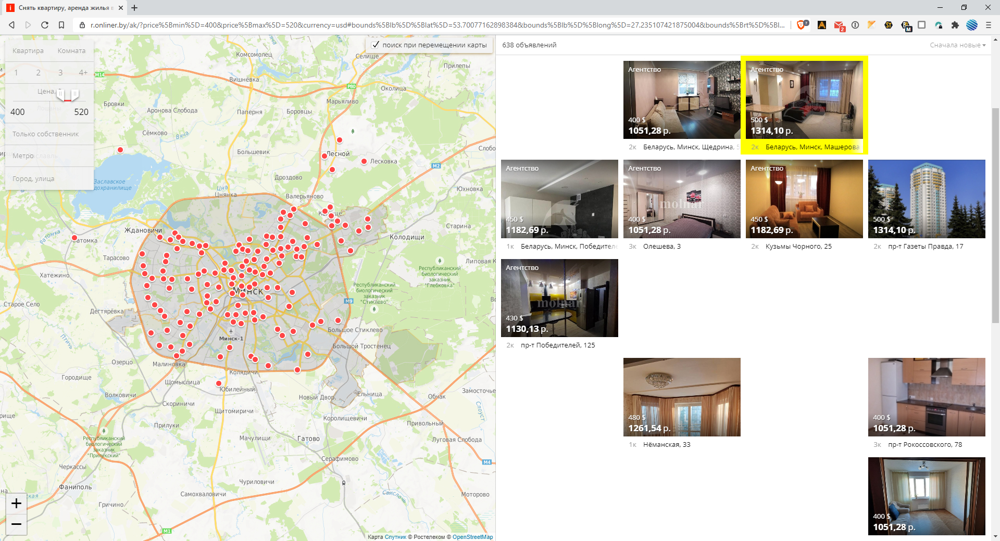
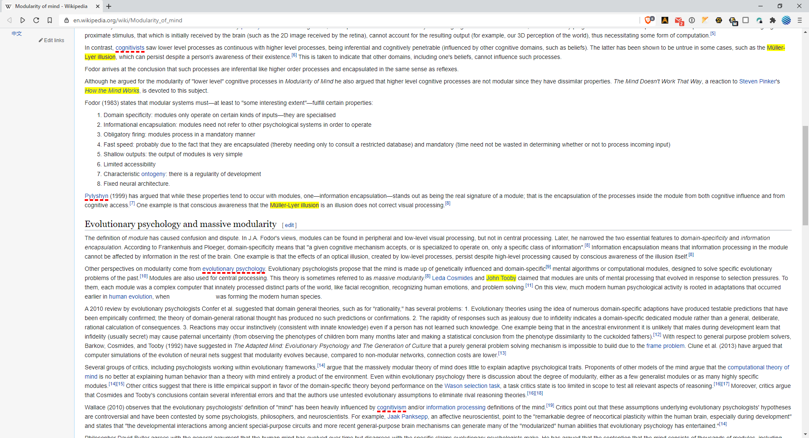

# MarkALink

### What does this thing do?

These images could point you to some additional uses of the extension. You are able to paint links in different colors or hide from your sight. Why? To not visit the same page (in development: the same website) twice. Didn't like it? Add to "Hide", so you won't be missvisiting it again. Extremely useful when you're looking for an apartment, for example, or you want to buy something and the list is constantly updating, mixing old and new results. This is actually the main reason MarkALink exists.

### What the next updates are gonna be?

- Add theme without glitches
- Add a possibility to Mark not only the page, but the website with all the pages, say hello to search engines and ads
- Add time to notifications
- Redesign of options page and adding a lot of different settings

### Current state

It's more like MVP (minimum viable product) right now, some features could work poorly, there could be lack of settings or some bugs, I'm sorry if there are. Let me know, I want to improve it. Still yours, RomanistHere@gmail.com
