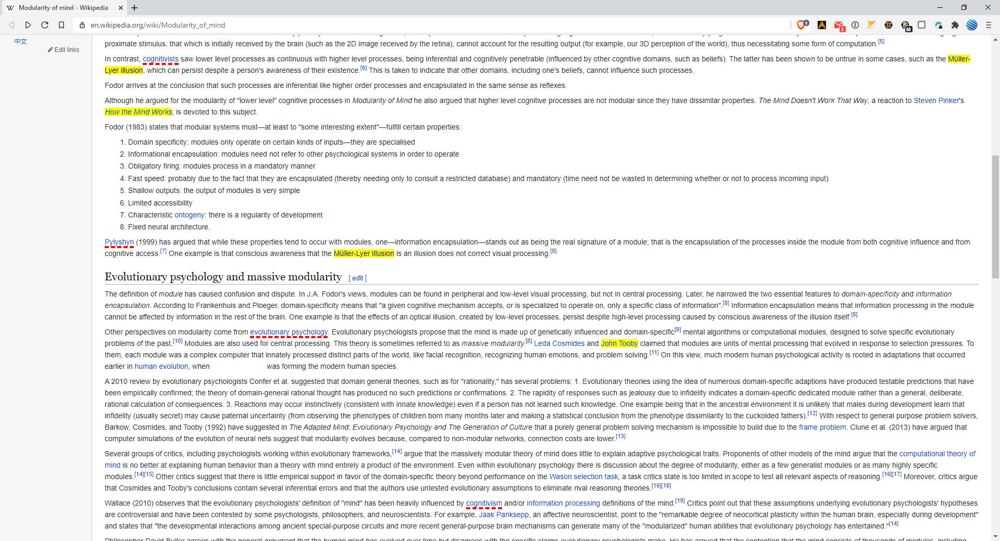

# MarkALink

### What does this thing do?

These images could point you to some uses of the extension. You are able to paint (highlight or underline - sets up from the options page) links in different colors or hide from your sight. Why? To not visit the same page or the same website twice. Didn't like it? Add to "Hide", so you won't be missvisiting it again. Extremely useful when you're looking for an apartment, for example, or you want to buy something and the list is constantly updating, mixing old and new results. This is actually the main reason MarkALink exists.

### How to use it

After you install the extension there are two ways to mark a link. First is to click the extension's icon - and click "Mark current page". It will open popup where you can edit the url address, change the group (think of it like a tag or folder), pick whether you going to mark a certain page (you are on right now by default) or the whole website - it means any link you will face to any page on this website is going to be recognized, add a notification (will popup when the time comes) and add your mark - usually, to briefly explain what is bad about the page/site.

Another way is to right-click the link and move the cursor to MarkAlink and click on the "Mark" option. "Hide" options are for fast hiding (adding to the Hide group) without a need to open the popup.

There are no such an option when you right-click? It means the element you click on is not a link, after all extension is called MarkALink, not MarkAnything, so nothing can be done here for now.

### What the next updates are gonna be?

- Add theme without glitches
- Add time to notifications
- Redesign options page and add a lot of different settings

### Current state

It's more like MVP (minimum viable product) right now, some features could work poorly, there could be lack of settings or some bugs, I'm sorry if there are. Let me know, we'll fix it. Always yours, RomanistHere@pm.me
